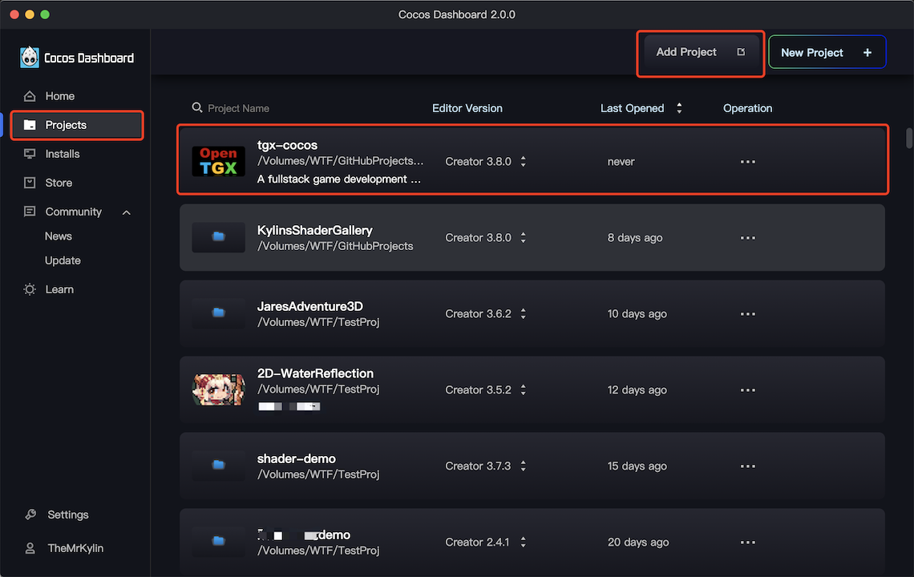

# 快速开始

## 获取 OpenTGX

### 从 Github 获取

使用 Git 工具从 [https://github.com/MrKylinGithub/OpenTGX](https://github.com/MrKylinGithub/OpenTGX) 获取。

### 从 Cocos Store 获取

可以免费从 [https://store.cocos.com/app/en/detail/2787](https://github.com/MrKylinGithub/OpenTGX) 获取。

## 目录介绍

OpenTGX: 根目录

- docs：文档
- tgx-cocos：基于 Cocos Creator 的客户端框架
  - assets/core_tgx：TGX 内核
  - assets/module_basic：基础模块
  - assets/module_demo_rooster：3D 游戏示例
  - assets/module_demo_tank：2D 游戏示例
  - assets/module_extra：动态模块示例
  - assets/res：资源
  - assets/scripts：主包使用的脚本
  - assets/start：开始场景，用于处理
- tgx-nodejs：基于 NodeJS + TS 的服务器框架
  - src： TypeScript 源码目录
    - AppServer.ts：入口程序
  - node_modules：nodejs 模块
  - build：生成后的 js 代码

## 客户端-环境搭建

### 1. 安装 Cocos Dashboard

Cocos 引擎具备双内核（C++内核和Web3D内核）、跨平台、高性能、低功耗等诸多优点，因此 OpenTGX 使用了 Cocos 引擎作为游戏客户端技术支撑，请先前往 [Cocos Creator - 下载页面](https://www.cocos.com/creator-download) 下载 Cocos Dashboard。

### 2. 添加项目



下载完 Cocos Dashboard 后，添加 ` tgx-cocos` 项目。可以看到它需要的 Cocos Creator 版本号。

### 3. 下载 Cocos Creator


切换到编辑器标签，我们点击安装按钮，找到对应的版本。点击右边的下载按钮，它下载完成后会自动安装。

### 4. 打开项目

回到项目标签，双击启动项目。 我们从 start 场景开始。可以看到它能正常运行起来，就表示我们的客户端环境搭建好了。


> Cocos Creator 使用 TypeScript 进行编程，请自行安装  Visual Studio Code  等工具。请参考 [Cocos 引擎官方文档 - 配置代码编辑环境](https://docs.cocos.com/creator/manual/zh/scripting/coding-setup.html)

## 服务器-环境搭建

### 1. 安装 NodeJS

OpenTGX 是基于 TypeScript 的全栈游戏开发技术方案，服务器是基于 NodeJS + TS 搭建。需要先安装 NodeJS 环境。

1. 在命令行工具中使用 `node -v` 检查是否安装了 NodeJS，如果安装了 NodeJS，请确保在 NodeJS 版本为 12+。

2. 如果没有安装 NodeJS，请前往 [https://nodejs.org](https://nodejs.org/) 下载 LTS 版本。

3. 安装完成后，重新打开命令行，输入 `node -v`，如果输出了 NodeJS 版本号，说明安装成功。

### 2. 初始化项目

1. 进入 tgx-nodejs 目录，执行 `npm init`
2. 待执行完成后，执行 `npx tsc` 即可编译项目
3. 执行 `node ./build/AppServer.js` 即可启动项目

### 3. IP 与端口

在服务端代码  AppServer.ts 中：

```ts
const IP = '127.0.0.1';
const PORT = 8002;
GlobalVar.server.listen(PORT,IP,()=>{
  console.log("Listening on", IP, ':', PORT);
});
```

服务器端 IP 默认为 '127.0.0.1'，只能供本机访问。

局域网访问，请改为 局域网IP，如：

```ts
const IP = '192.168.0.222';
```

外网访问，请改为 '0.0.0.0'：

```ts
const IP = '0.0.0.0';
```

> 如果本机要挂 Nginx  等反向代理来配置 wss 或者负载均衡策略，建议配置为 `'127.0.0.1'`，反向代理那边配置外网访问即可。
> 如果 Nginx  等反向代理在局域网中的其他机器上，则 IP 配置为局域网 IP 即可。
