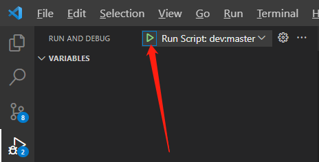

# tgx-metaverse-online
tgx-metaverse-online 是一个基于 OpenTGX 的 TypeScript 全栈多人在线元宇宙模板，联机元宇宙可从它开始。它拥有以下主要特性：
  - 拥有公共子世界管理、私人子世界管理、聊天系统、角色状态同步等机制，能够很好地划分世界空间，实现项目内容。
  - 前端基于 tgx-core-cocos，能够快速处理各类问题并发布到各个平台。
  - 后端基于 [tsrpc](https://tsrpc.cn/)，一个便捷轻量的 NodeJS 服务器框架，由众多项目实践提炼而成，
  - 多进程架构，可通过集群部署实现扩容，充分利用多核和多机能力。

## 环境配置与启动

tgx-metaverse-online 客户端基于 [Cocos Creator](https://www.cocos.com/)，服务端基于 [TSRPC](https://tsrpc.cn/)，前后端编程语言统一为 TypeScript。

请先参考 [快速开始](./quick-start.md) 配置相关环境。

### 服务器配置与启动
`tgx-metaverse-server` 目录下为服务端项目源码，完整的配置和启动流程如下：
1. 进入 `tgx-metaverse-server` 目录，启动控制台
2. 执行 `npm install`，安装相关依赖
3. 执行 `npm run dev:master` 启动主管服进程
4. 在 `tgx-metaverse-server` 目录下启动一个新的控制台
5. 执行 `npm run dev:world` 启动世界服进程

到此服务器就启动成功了。

### 客户端配置与启动。
`tgx-metaverse-client` 目录下为客户端项目源码，完整的配置和启动流程如下：
1. 进入 `tgx-metaverse-client` 目录，启动控制台
2. 执行 `npm install`，安装相关依赖
3. 启动 Cocos DashBoard，添加 `tgx-metaverse-client` 项目。
4. 如果需要的 Cocos Creator 版本未安装，则先安装。
5. 双击打开项目。
6. 选择 start 作为启动场景
7. 点击预览按钮启动预览

> 如果客户端启动报错，大概率是因为 shared 目录未生效导致的，请查看 [共享目录](#共享目录)

## 服务器调式
在 VSCode 以调试方式启动进程，即可方便进行断点调试。
1. 切换到 VSCode 的调试面板
2. 选择 `Nodejs...`
3. 在弹出的下拉列表中选择 `dev:master` 或 `dev:world`


4. 选择进程后，点击启动按钮即可启动进程


相关命令请查看 `tgx-metaverse-server/pacakge.json` 中的　`scripts` 部分。

## 共享目录
一些客户端与服务器需要共享的协议、代码和配置，均放在下面位置：
- 服务器：`tgx-metaverse-server/src/shared/`
- 客户端：`tgx-metaverse-client/assets/module_basic/shared/`

客户端的 shared 是从服务器目录软链或者 copy 过来的。推荐使用软链(symlink)方式，这样两端都可以修改。

修改完毕后，执行 `npm run sync` 即可完成同步。

如果想要修改客户端 shared 目录位置或者同步方式，请前往：`tgx-metaverse-server/tsrpc.config.ts` 中的 `sync` 字段。

## 服务器编码与编译
如果服务器进程处于运行状态（在控制台中运行或者调试运行），当我们按下 `CTRL + S` 后，会自动执行 编译、同步、重启进程操作，很方便。

如果是在这种状态下编程，则不需要手工调用 `npm run sync` 了。

因此，协议相关的代码修改，建议在服务器目录下进行，可以省下大量的同步工作。


## IP与端口

`master` 进程的端口在 `src/MasterServerMain.ts` 下，默认为 `3000`，可以修改这里，也可以在启动时，传入 `PORT 端口号` 来修改。

`world` 进程的端口在 `src/WorldServerMain.ts` 下。

- `masterServerUrl`：是大厅服的地址和端口，如果大厅服有修改，这里需要同步。
- `thisServerUrl`：本世界服端口。

```ts
const masterServerUrl = process.env['MASTER_SERVER_URL'] || 'http://127.0.0.1:3000';
const thisServerUrl = process.env['THIS_SERVER_URL'] || ('ws://127.0.0.1:' + port);
```

### 局域网访问
如果需要局域网访问，比如用手机和其他机器一起调试。则所有 `127.0.0.1` 都需要改为对应机器的 IP。

### 外网直接访问
直接访问的情况下，把所有 `127.0.0.1` 相关的改为 `0.0.0.0`。
### nginx 反向代理
如果需要 nginx 等反向代理（一般都需要的，方便配置安全策略和 wss,https），则不需要配置为 `0.0.0.0`，如果 nginx 在本机，就保持 `127.0.0.1`，如果 nginx 不在本机，则配置为局域网 IP 即可。

## 服务端架构与子世界浅析

### 进程架构

tgx-metaverse 主要由两个进程构成 master 和 world

`master`：主管进程，负责用户数据管理（登录、创建角色等）和全局功能（排行榜、签到、任务、子世界进出管理、全世界聊天等等）。 客户端与 master 进程的通信为 HTTP 通信。

`world`：世界管理进程，负责具体的世界玩法，如子世界内的角色数据同步，交互等等。 客户端与 world 进程的通信为 Websocket 通信。 每一个世界管理进程，会负责若干个独立的子世界。

master 和 world 是一对多的关系，因为 world 进程负担较重，单进程难以承担较多玩家。通过多进程可以很好地进行负载提升。

### 通信流程

#### 1. 用户登录
用户登录时，会先向 master 进程通信。如果账号密码验证通过，则会获得一个 token。 后续的交互都使用这个 token 进行，不再需要账号密码。

#### 2. 未进入元宇宙子世界
当用户未处于任何元宇宙子世界时（比如角色创建、一些特殊的页面），用户不会连接任何 world 进程。

#### 3. 进入元宇宙子世界
当用户想要进入元宇宙子世界时，需要先向 master 进程发送进入请求，master 在收到请求后，会根据 subWorldId 查询哪一个 world 进程负责对应的子世界。

如果有找到，则返回对应的登录信息，其中包括对应子世界的链接地址。 客户端在拿到地址后，去连接对应的 world 进程，进行交互。

> 注意，master 返回给用户的用于登录 world 进程的数据，采用了 md5 签名校验，自己的项目请悄悄修改的密钥。

## 子世界类型
子世界有两种类型， 公共子世界和私有子世界。

- 公共子世界：由服务器自动创建和管理，所有符合条件的人都可以进入（通常无限制），常驻于服务器。类似于游戏中的主城和野外地图。
- 私人子世界：由用户发起创建，只有特定的人群可以进入。类似于对战游戏中的一个房间或者临时开启的多人副本。

子世界有两个关键的 id。
- subWorldId: 实例ID
- subWorldConfigId：模板ID

由于公共子世界只有一份，所以公共子世界的 subWorldId 直接使用了 subWorldConfigId。这样可以方便进行跳转配置和玩法设计。

每一个 world 进程可以决定自己负责哪些公共子世界，在启动时会自动创建好。可以查看：`src/WorldServerMain.ts` 中的 `publicSubWorldList` 了解详情。

每一个 world 进程可以决定自己负责哪些私人子世界，这个暂时还未实现。


## 子世界配置

src/shared/SubWorldConfig.ts 下，是子世界的配置。

```ts
const _subWorldList = [
    //公共子世界
    { id: 'world-001', name: '北京', scene: 'world', isPublic: true, levelData: { prefab: 'levels/level-beijing', bundle: 'module_metaverse' } },
    { id: 'world-002', name: '上海', scene: 'world', isPublic: true, levelData: { prefab: 'levels/level-shanghai', bundle: 'module_metaverse' } },
    { id: 'world-003', name: '成都', scene: 'world', isPublic: true, levelData: { prefab: 'levels/level-chengdu', bundle: 'module_metaverse' } },
    { id: 'world-004', name: '深圳', scene: 'world', isPublic: true, levelData: { prefab: 'levels/level-shenzhen', bundle: 'module_metaverse' } },

    //私人子世界，用于副本，房间类玩法。可根据情况自行创建和销毁
    { id: 'battle-game', name: 'Battle Game', scene: 'world', isPublic: false, levelData: null },
    { id: 'card-game', name: 'Card Game', scene: 'world', isPublic: false, levelData: null },
    { id: 'rpg-game', name: 'RPG Game', scene: 'world', isPublic: false, levelData: null },
];
```

其中  id  就是 `subWorldConfigId`。它决定了一个子世界的基本信息。
- name：用于显示的名称
- scene: 客户端对应的场景名称
- isPublic：是否为公共子世界
- levelData：关卡配置（当每一个子世界独享场景时，不需要levelData。当多个子世界想要共享一个基本的场景时，就需要将关卡数据和静态场景数据分离，此时我们就会把关卡配置单独存为一个 prefab。）
- bundle：从哪个包中加载场景和 prefab。